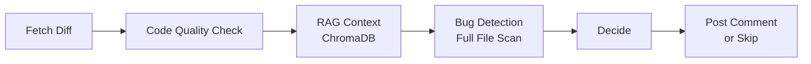

# 🛡️ CodeSentinel

**An autonomous AI agent that reviews GitHub Pull Requests** — combining diff analysis, full-codebase RAG context, and LLM-driven decision-making to post intelligent, high-signal code review comments automatically.

CodeSentinel goes beyond simple diff review: it inspects the entire file for pre-existing bugs, checks whether changed functions are used elsewhere in the codebase, and intelligently decides whether a comment is even worth posting — avoiding noisy, low-value reviews.

## ✨ What It Does

When a Pull Request is opened or updated, CodeSentinel automatically:

1. **Fetches the diff** — the exact lines changed in the PR
2. **Reviews the diff** — checks if the new change is correct or introduces a bug
3. **Retrieves related code (RAG)** — searches the entire codebase for functions related to the change, using vector similarity search
4. **Scans the full file** — detects pre-existing bugs, missing validations, and edge cases that existed before the PR
5. **Decides intelligently** — only posts a comment if genuine issues are found; stays silent on clean PRs
6. **Posts the review** — as a structured, markdown-formatted comment directly on the GitHub PR

All of this happens **automatically via CI/CD** — no manual intervention required.

## 🏗️ Architecture

CodeSentinel is built as a multi-node agentic pipeline using **LangGraph**. Each node reads and updates a shared state, making the flow explicit, debuggable, and easy to extend.



An earlier, tool-calling version of the agent (`agent_mcp.py`) was also built using the **Model Context Protocol (MCP)**, where the LLM autonomously decides which tools to call and in what order — demonstrating both explicit (LangGraph) and dynamic (MCP) agent orchestration patterns.

## 🧰 Tech Stack

| Component | Technology |
|---|---|
| LLM | Groq API (`openai/gpt-oss-120b`) |
| Agent Orchestration | LangGraph (`StateGraph`) |
| Tool-based Agent (alt. version) | Model Context Protocol (MCP) |
| Embeddings | `sentence-transformers` (`all-MiniLM-L6-v2`) |
| Vector Database | ChromaDB (HNSW indexing, cosine similarity) |
| Code Chunking | Python `ast` module (function-level, AST-based) |
| GitHub Integration | GitHub REST API |
| CI/CD | GitHub Actions |

## 📂 Project Structure

- `graph_agent.py` — Main LangGraph pipeline (production agent)
- `agent_mcp.py` — Alternative MCP-based tool-calling agent
- `mcp_server.py` — MCP server exposing GitHub + RAG tools
- `rag_chunker.py` — AST-based code chunking
- `rag_embeddings.py` — Embedding generation
- `rag_store.py` — ChromaDB storage & semantic search
- `evaluate.py` — Evaluation script (precision/recall)
- `EVALUATION.md` — Evaluation results & methodology
- `test_github.py`, `test_review.py` — Early prototyping scripts

## 🚀 How It Works in CI/CD

A GitHub Actions workflow (in the target repository) triggers on every `pull_request` event:

```yaml
on:
  pull_request:
    types: [opened, synchronize, reopened]
```

The workflow checks out this agent's code, installs dependencies, and runs `graph_agent.py` with the PR number and branch passed in as environment variables — fully automated, from PR creation to review comment.

## 📊 Evaluation

CodeSentinel was tested against a test repository with 11 deliberately planted bugs (with no hints or comments revealing them):

| Metric | Result |
|---|---|
| **Recall** | 10/11 bugs found (~91–95%) |
| **Precision** | ~100% — zero false or fabricated issues |

The agent also surfaced several legitimate issues beyond the original bug set, demonstrating generalization rather than pattern-matching on known test cases.

Full methodology and detailed breakdown: [EVALUATION.md](./EVALUATION.md)

## 🔑 Setup

1. Clone this repository
2. Install dependencies:
```
   pip install requests python-dotenv groq mcp langgraph chromadb sentence-transformers einops
```
3. Create a `.env` file with:
```
   GITHUB_TOKEN=your_github_token
   GROQ_API_KEY=your_groq_api_key
```
4. Run locally:
```
   python graph_agent.py
```

For CI/CD, add `GH_TOKEN` and `GROQ_API_KEY` as repository secrets in the target repo, and add the provided GitHub Actions workflow under `.github/workflows/`.

## 🎯 Key Design Decisions

- **Diff + full-file review** — reviews both what changed *and* what was already broken, rather than just the diff
- **RAG-based cross-codebase impact** — checks if changed functions are used elsewhere before flagging cross-file risk
- **Conditional commenting** — skips posting when no genuine issues are found, avoiding review noise
- **Retry logic** — gracefully handles occasional malformed LLM tool-call outputs without crashing the pipeline
- **AST-based chunking with fallback** — falls back to whole-file chunking when syntax errors prevent AST parsing, ensuring no code is silently dropped from the RAG index

## 📄 About

This project was built as a hands-on learning and portfolio project to explore agentic AI system design — combining LLM-based code review, Retrieval-Augmented Generation (RAG), multi-step agent orchestration (LangGraph & MCP), and CI/CD automation into a single end-to-end working system.


